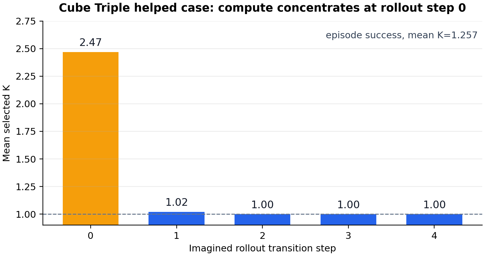
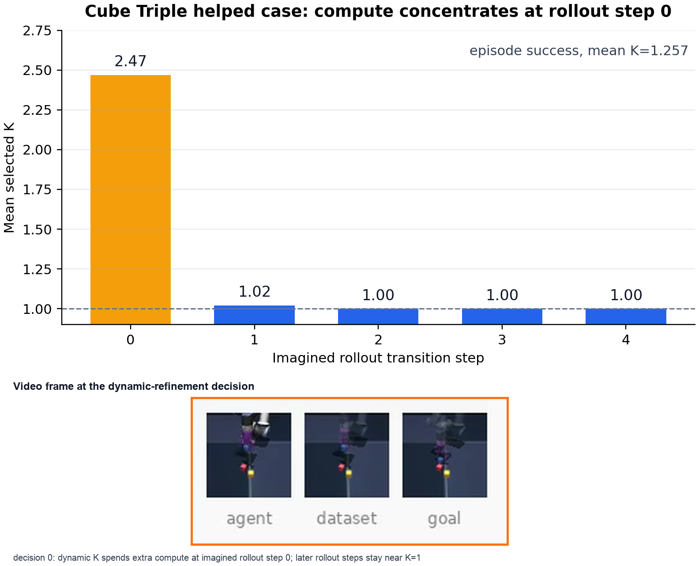
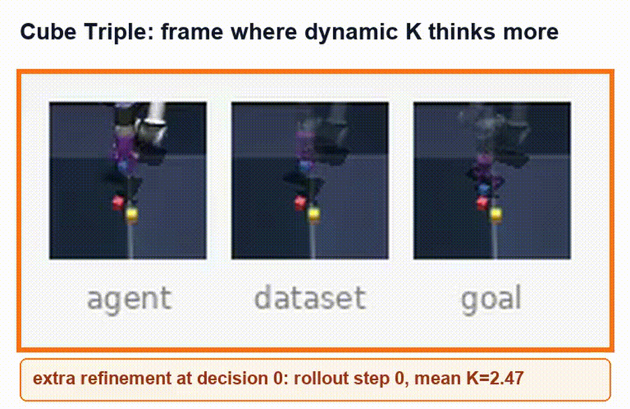
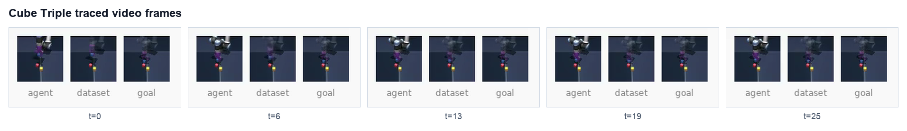
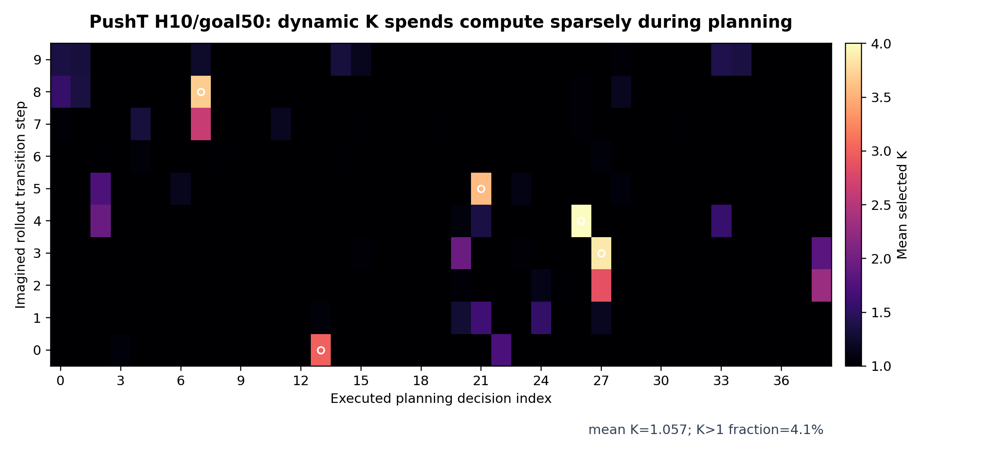
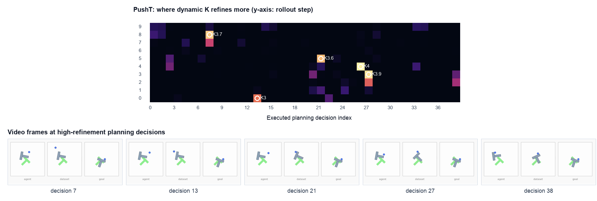
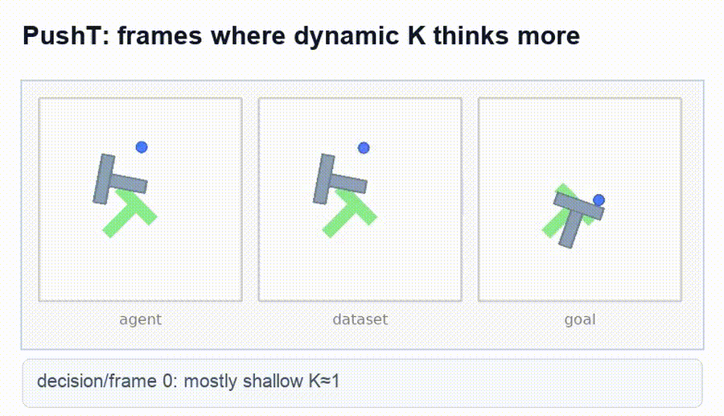
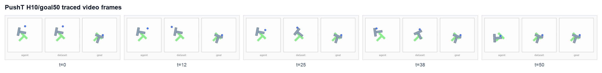
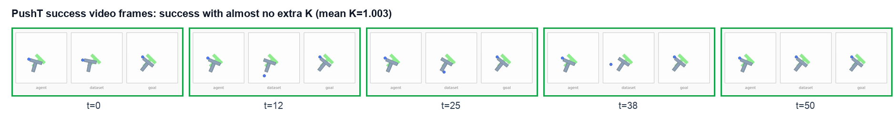
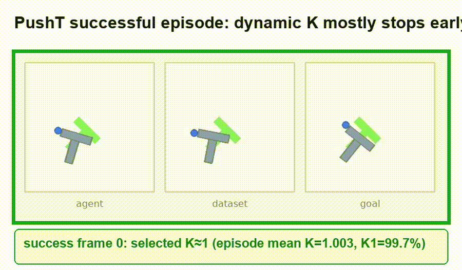

# RefineJEPA: Dynamic K for JEPA Latent Planning

中文说明见 [README.zh-CN.md](README.zh-CN.md).

RefineJEPA studies **dynamic test-time compute** inside JEPA-style latent
world-model planning. Instead of using the same transition-model depth for
every imagined transition, RefineJEPA learns when an imagined transition should
receive additional recurrent refinement.

The current working question is simple:

> In latent MPC/CEM planning, which imagined transitions are worth refining
> more deeply?

This repository is the RefineJEPA / TTJepa code and experiment ledger. The
local source tree contains the recurrent transition predictor, learned
continue-head training, evaluation hooks, and paper-facing result records. The
large-scale training and evaluation runs are executed on the remote TTJepa
workspace:

- remote: `ssh -p 20747 root@115.190.235.210`
- repo: `/vepfs/zijian/TTJepa`
- data/results: `/vepfs/zijian/lewm_data`
- branch: `codex/recurrent-lewm`

The original LeWM README content has been preserved in
[LEWM_REPRODUCTION_NOTES.md](LEWM_REPRODUCTION_NOTES.md). This README is the
RefineJEPA-first project entrypoint.

## Motivation

Consider a robot reaching for an object. Moving the arm through free space is
often easy to predict: a shallow latent transition is enough. But the moment of
contact, lifting, sliding, or multi-object interaction can be planning-critical:
a small dynamics error can change the selected action. A latent planner should
therefore spend little compute on easy imagined transitions and more compute on
transitions whose refinement can affect the planner's decision.

RefineJEPA focuses on this transition-level compute axis:

- standard latent planning spends compute on CEM sampling width, CEM
  iterations, or rollout horizon;
- RefineJEPA spends compute inside each imagined latent transition through
  recurrent refinement depth \(K\);
- dynamic \(K\) chooses the depth per imagined transition rather than applying a
  fixed depth everywhere.

## Method Summary

RefineJEPA starts from LeWM-style latent planning: encode the current visual
observation and goal, roll out candidate action sequences in latent space, and
use CEM to choose the action sequence with the best terminal goal-matching
cost. The outer planner is unchanged. RefineJEPA changes only the transition
predictor.

The transition model is a weight-tied recurrent predictor. At each imagined
transition it produces predictions

\[
\hat z_{t+1}^{(1)}, \hat z_{t+1}^{(2)}, \ldots, \hat z_{t+1}^{(K_{\max})}.
\]

A lightweight continue head predicts whether another refinement step is worth
executing. The main learned dynamic-\(K\) experiments train this head with a
relative marginal MSE target:

\[
y_k =
\mathbb{I}
\left[
\frac{e_k - e_{k+1}}{e_k+\epsilon}
>
\tau_{\mathrm{rel}}
\right],
\qquad
\tau_{\mathrm{rel}}=5\times10^{-4}.
\]

Here \(e_k\) is the raw latent MSE at refinement depth \(k\), computed against
the observed next latent during training. At test time, the future latent is not
available: the model stops using only the learned continue head. We sweep the
test-time continue threshold \(\eta\) and report the best success/compute point.

Main configuration for the learned dynamic-\(K\) runs:

| Setting | Value |
| --- | ---: |
| Max refinement depth | \(K_{\max}=4\) |
| Halt label mode | relative marginal MSE improvement |
| \(\tau_{\mathrm{rel}}\) | \(5\times10^{-4}\) |
| Continue-head loss weight | \(0.2\) |
| Minimum depth | \(1\) |

Mean \(K\) always denotes the average selected refinement depth over all CEM
imagined transition predictions, not a fractional per-transition depth. Internally
each transition still uses an integer depth in \(\{1,2,3,4\}\).

## Implementation Details: Continue Head And Action Conditioning

**What supervision trains the latent continue head?** The current learned
dynamic-\(K\) head is trained from relative marginal raw latent-MSE improvement.
During training, the predictor runs all refinement depths and compares each
prediction to the observed next latent. The continue label at depth \(k\) is 1
when one more refinement step reduces MSE by more than a small relative margin:

\[
y_k =
\mathbb{I}
\left[
\frac{e_k - e_{k+1}}{e_k+\epsilon}
>
5\times 10^{-4}
\right].
\]

At evaluation time, the future target latent is unavailable. The model uses
only the learned continue head to decide whether to stop or refine.

**Is the transition layer an MLP or a transformer?** The transition predictor is
a recurrent, action-conditioned transformer predictor. It has:

- a base action-conditioned transformer with `base_depth=2`;
- a shared recurrent refinement cell with `refine_depth=1`;
- a linear `init_head` for the initial prediction;
- linear `delta_head` and `gamma_head` for residual latent updates;
- a linear `continue_head` for stop/continue prediction.

The refinement cell is weight-tied across depths. Increasing \(K\) reuses the
same cell multiple times; it does not create a deeper untied model.

**What is the continue head structure?** The continue head itself is a linear
classifier:

\[
p_k=\sigma(W h_k+b).
\]

It is not an MLP or transformer. The reason this can still be expressive is
that \(h_k\) is already produced by action-conditioned transformer/refinement
blocks and contains the transition history, candidate action context, and the
current refinement feedback.

**How is it based on action?** Raw actions are first encoded by an action
encoder into action embeddings. Those embeddings condition both the base
transformer and every recurrent refinement cell through conditional transformer
blocks. Therefore the continue head reads \(h_k\), but \(h_k\) is already
conditioned on the candidate action sequence:

\[
p(\mathrm{continue})
=
g(h_k),
\qquad
h_k = F(h_{k-1}, z_{\mathrm{hist}}, a_{\mathrm{hist}}, \hat z^{(k-1)}-z_{\mathrm{anchor}}).
\]

Thus different CEM candidate action sequences can produce different hidden
states and different selected depths.

## Main Learned Dynamic-K Results

The table below is the current main result. It uses the relative-improvement
continue target with \(\tau_{\mathrm{rel}}=0.0005\) across all four datasets.
In discussion we refer to this setting as `rel0005`; the remote artifact
directories for this four-dataset sweep are named `rel00005`.
Fixed \(K\) rows and learned dynamic rows are evaluated within the same
checkpoint family. LeWM is the original non-recurrent baseline; fixed
\(K=1,2,3,4\) are separate RefineJEPA evaluations and should not be collapsed
into a single "best fixed" column.

| Dataset | LeWM baseline | Fixed K1 | Fixed K2 | Fixed K3 | Fixed K4 | Learned dynamic K |
| --- | ---: | ---: | ---: | ---: | ---: | ---: |
| Reacher | 81.3% | 84.0% | 82.0% | 83.3% | 82.7% | **85.3%@K1.03** \((\eta=0.45)\) |
| Cube Single | 72.0% | **79.3%** | 78.7% | 78.0% | 78.0% | **79.3%@K1.00** \((\eta=0.70)\) |
| Cube Double | **74.7%** | 72.0% | 72.0% | 72.7% | 72.0% | 74.0%@K1.26 \((\eta=0.45)\) |
| Cube Triple | 74.0% | 74.0% | 74.0% | 73.3% | 74.0% | **77.3%@K1.22** \((\eta=0.30)\) |

Interpretation:

- Reacher and Cube Triple improve over both LeWM and every fixed \(K\) while
  using near-\(K=1\) average compute.
- Cube Double improves over every fixed \(K\), but the original LeWM baseline is
  still slightly higher in this 3-seed average. This is a useful reminder that
  the recurrent predictor and the dynamic selector should be compared
  separately.
- Cube Single is the useful negative/control case: this checkpoint's best fixed
  depth is already \(K=1\), and the learned selector correspondingly keeps
  almost everything at \(K=1\).
- The main claim is not "deeper is always better." The claim is that transition
  depth is a real compute axis and should be allocated dynamically.

This table supersedes the older `ttjepa_*_dynamic_oracle_k4_10e` learned-head
sweep. That earlier sweep used raw target-MSE depth labels and is kept as a
historical comparison in the experiment ledger.

## Depth Allocation Statistics

The best learned dynamic policies spend extra compute on a subset of imagined
transitions. The table below aggregates the final 3-seed sweep using the same
threshold reported in the main table for each dataset.

| Dataset | Best dynamic | K=1 | K=2 | K=3 | K=4 | Refined beyond K1 |
| --- | ---: | ---: | ---: | ---: | ---: | ---: |
| Reacher | 85.3%@K1.03 | 96.77% | 3.11% | 0.12% | 0.003% | 3.23% |
| Cube Single | 79.3%@K1.00 | 99.984% | 0.017% | 0.0001% | 0% | 0.017% |
| Cube Double | 74.0%@K1.26 | 76.49% | 21.09% | 1.69% | 0.72% | 23.51% |
| Cube Triple | 77.3%@K1.22 | 89.41% | 3.71% | 2.64% | 4.25% | 10.59% |


The plot shows that dynamic \(K\) keeps most imagined transitions shallow while
spending extra recurrent refinement on a small subset.

We also trace where extra refinement is spent inside each CEM rollout. The
location is not uniform. The standalone trace script now mirrors `eval.py` and
fills `world.max_episode_steps` from `2 * eval_budget` when the eval config
leaves it unspecified. The repaired run produced Cube Triple and PushT
where-compute traces under
`/vepfs/zijian/TTJepa/analysis/where_compute_rel00005_20260703`.


The selected extra depth is mostly \(K=2\), with rare \(K=3/K=4\) use.


The local traces show the same behavior at the episode level. For the selected
Cube Triple helped case (`train=3074`, `eval_seed=44`, `idx=12`), the main-table
threshold \(\eta=0.30\) succeeds with mean depth \(1.257\). Extra compute is
concentrated at the first imagined rollout transition: rollout step 0 reaches
mean selected \(K=2.47\), while later imagined steps remain near \(K=1\).



Video frame aligned with the dynamic-refinement location:



Animated preview:



MP4: [where_compute_cube_triple_annotated.mp4](figures/where_compute_cube_triple_annotated.mp4)

Raw video frames from the same traced Cube Triple rollout:



Video: [cube_triple_t030_env_0.mp4](figures/video_cube_triple_t030_env_0.mp4)

For PushT H10/goal50, the repaired trace has mean depth \(1.057\) over
3.51M imagined predictions. Most cells remain near \(K=1\), but sparse
planning-decision/rollout-step patches reach \(K \approx 4\). This is the
cleaner aggregate heatmap for showing that dynamic \(K\) allocates compute
sparsely rather than applying uniformly deep refinement. This aggregate trace
should not be used as a success video: its high-refinement cells summarize a
batch of episodes, not one successful rollout.



The more useful visualization aligns high-refinement cells with video frames
from the corresponding executed planning decisions:



Animated preview:



MP4: [where_compute_pusht_annotated.mp4](figures/where_compute_pusht_annotated.mp4)

Representative raw video frames from `env_0` in the same PushT trace:



Video: [pusht_h10_goal50_env_0.mp4](figures/video_pusht_h10_goal50_env_0.mp4)

A cleaner single-episode PushT example is
`global=1474257` at threshold \(\eta=0.30\). This trace is success=True under
the evaluator, is visually much closer to the PushT goal configuration, and
uses substantial extra refinement: mean \(K=1.287\), \(21.8\%\) of imagined
predictions use \(K>1\), and several planning windows reach \(K \approx 3\).
This is the preferred success-plus-extra-refinement video.


Animated success preview:


MP4: [pusht_success_highk_env6_annotated.mp4](figures/pusht_success_highk_env6_annotated.mp4)

The successful PushT episode in this 20-case trace is `env_12`. Its single-case
trace succeeds but uses almost no extra refinement: mean \(K=1.003\), with
\(99.68\%\) of predictions stopping at \(K=1\). This is useful evidence in the
opposite direction: some successful plans are easy and should not spend extra
compute.



Animated success preview:



MP4: [pusht_success_env12_annotated.mp4](figures/pusht_success_env12_annotated.mp4)

### Section 5.3: Where the Computation Goes

The aggregate depth-allocation plots above show that learned dynamic \(K\)
uses extra compute sparsely. The repaired where-compute traces make this
behavior qualitative and local:

- choose a Cube Triple episode where \(K=1\) fails and deeper refinement
  succeeds, then run the learned dynamic policy on the same starting state;
- plot a heatmap with executed planning decision on the x-axis and imagined
  rollout transition step on the y-axis;
- color each cell by mean selected \(K\) or by the fraction of candidates
  refined beyond \(K=1\), averaged over the final CEM iterations;
- show nearby rendered frames from the same episode so the high-depth region
  can be compared against contact or decision-boundary moments;
- add a decoder-free latent visualization: for each \(K=1,\ldots,4\) predicted
  latent, retrieve the nearest observed dataset frame in embedding space. This
  is a qualitative proxy for "what this latent looks like"; it is not a trained
  pixel decoder and does not change the model;
- repeat the rollout-step trace on PushT to test whether extra refinement is
  sparse over planning decisions and imagined rollout positions.

The remote analysis uses
`scripts/trace_depth_allocation.py` plus
`scripts/visualize_latent_retrieval.py`, and writes outputs under
`/vepfs/zijian/TTJepa/analysis/where_compute_rel00005_20260703`. The important
generated subdirectories are
`cube_triple_helped_train3074_eval44_idx12_t030` and
`pusht_h10_goal50_seed42_aggregate`. These figures support the paper claim that
dynamic \(K\) is not merely lowering average compute; it reallocates refinement
to a small subset of planning-sensitive imagined transitions.

## Raw Latent MSE Diagnostic

Before training the continue head, we used raw target-latent MSE as a post-hoc
diagnostic: after fixed-depth evaluation, compare true target-latent errors at
different depths and choose whether shallow or deeper prediction should have
been used. This is not deployable because it uses future target information,
but it measures whether raw latent error contains useful allocation signal.

The old diagnostic table only selected between \(K=1\) and \(K=4\). That is
too narrow for the current paper because the main experiment evaluates
\(K=1,2,3,4\). The table below uses the same 3-seed train/eval set as the main
result and allows both diagnostic choosers to select among all four fixed
depths.

| Dataset | Fixed K1 | Fixed K2 | Fixed K3 | Fixed K4 | Target-MSE K1-4 chooser | Hindsight K1-4 chooser |
| --- | ---: | ---: | ---: | ---: | ---: | ---: |
| Reacher | 84.0% | 82.0% | 83.3% | 82.7% | 84.0%@K1.00 | **86.0%@K1.02** |
| Cube Single | 79.3% | 78.7% | 78.0% | 78.0% | 79.3%@K1.00 | 79.3%@K1.00 |
| Cube Double | 72.0% | 72.0% | 72.7% | 72.0% | 72.0%@K1.00 | **74.7%@K1.03** |
| Cube Triple | 74.0% | 74.0% | 73.3% | 74.0% | 74.0%@K1.00 | **78.7%@K1.07** |

The recomputation writes to
`/vepfs/zijian/TTJepa/analysis/k_refinement_rel00005_same_set_k1234_3seed`.
The old K1/K4 split remains useful as an outcome-analysis view, but it should
not be the main diagnostic table.

Takeaways:

- Target-MSE diagnostics should choose over the same depth set used by the main
  fixed-depth experiments.
- Hindsight selection should likewise report the shallowest successful depth
  among \(K=1,2,3,4\), not only a K1/K4 chooser.
- The K1/K4 helped/hurt split is still useful, but it belongs in the mechanism
  section as a paired outcome analysis.

## Mechanistic Analysis

We tested whether deeper recurrent refinement simply causes global latent
smoothing or collapse. The first pass does not support that explanation.

Artifacts: `analysis/k_smoothing_20260622`.


Observed result:

- Global latent spectrum barely changes from K1 to K4.
- Linear state probes are also nearly unchanged.
- Depth-helped and depth-hurt subsets do not show a clean global-collapse
  signature.

This suggests the remaining failure mode is more local: extra refinement matters
when it changes CEM candidate ranking or selected actions, not necessarily when
it changes broad latent-spectrum statistics.

## Future Work: Planner-Aware Continue Supervision

The current continue head learns from latent prediction improvement. A natural
next step is to train the same lightweight head with a more planner-aware
teacher signal.

The earlier CEM-aware diagnostic did this offline: for the same CEM candidate
set, it evaluated costs at \(K=1,2,3,4\), constructed features from top-k cost
statistics and elite-ranking changes, and trained a separate MLP selector to
predict whether deeper \(K\) improves planner cost. This was useful evidence
that CEM ranking contains allocation signal, but it was not integrated into the
transition predictor and did not provide a cheap deployable stopping rule.

The cleaner future variant is:

1. During training, sample a small set of candidate action sequences.
2. Roll them out at multiple depths.
3. Use top-k CEM cost improvement or elite-ranking change to create a
   planner-aware continue label.
4. Train the existing `continue_head(h_k)` with this label while keeping the
   planner-derived label stop-gradient.
5. At evaluation time, still use only the cheap latent continue head.

This would distill an expensive CEM-aware teacher into the transition-level
head. The goal is to replace "does one more step reduce latent MSE?" with the
more planner-aligned question: "does one more step improve the candidate
ranking or action selection that CEM actually uses?"

## Experiment Ledger

Full experiment records, including paths, logs, exploratory alternatives, and
older checkpoint families, are kept in:

- [TTJEPA_EXPERIMENT_RESULTS.md](TTJEPA_EXPERIMENT_RESULTS.md)
- [TTJEPA_DYNAMIC_K_RESEARCH.md](TTJEPA_DYNAMIC_K_RESEARCH.md)
- [paper.md](paper.md)

Important local artifacts:

- `analysis/k_refinement_all_20260620_024634/`
- `analysis/k_smoothing_20260622/`
- `analysis/paper1_figures/`
- `figures/depth_allocation_rel00005.png`
- `figures/depth_by_rollout_step_rel00005.png`
- `figures/depth_by_rollout_step_stacked_rel00005.png`

Important remote result directories:

- `/vepfs/zijian/lewm_data/ttjepa_reacher_joint_marginal_rel00005_k4_10e`
- `/vepfs/zijian/lewm_data/ttjepa_cube_joint_marginal_rel00005_k4_10e`
- `/vepfs/zijian/lewm_data/ttjepa_cube_double_joint_marginal_rel00005_k4_10e`
- `/vepfs/zijian/lewm_data/ttjepa_cube_triple_joint_marginal_rel00005_k4_10e`

Naming note: the main result above is the \(\tau_{\mathrm{rel}}=0.0005\)
four-dataset sweep. Some older notes abbreviate this setting as `rel0005`.
The remote directory spelling is `rel00005`. A separate cube-triple-only
directory named `rel0005` also exists and is treated as an auxiliary
training-variant record in the experiment ledger, not the four-dataset main
table.

## Repository Layout

Current high-level organization:

```text
.
├── README.md                         # RefineJEPA project entrypoint
├── README.zh-CN.md                   # Chinese project notes
├── TTJEPA_EXPERIMENT_RESULTS.md      # Full experiment ledger
├── TTJEPA_DYNAMIC_K_RESEARCH.md      # Working research notes
├── paper.md                          # Paper outline / claim boundary notes
├── jepa.py                           # JEPA model and rollout/eval hooks
├── module.py                         # recurrent predictor and continue head
├── recurrent_halting.py              # continue-label construction
├── train.py                          # training losses and logging
├── eval.py                           # CEM/MPC evaluation entrypoint
├── config/                           # train/eval Hydra configs
├── analysis/                         # local analysis figures copied for README/paper
└── figures/                          # main paper/README figures
```

## Cleanup Roadmap

The next repo cleanup pass should be:

1. Keep README focused on the current RefineJEPA paper story.
2. Keep long experiment tables, failed variants, and path-heavy records in
   [TTJEPA_EXPERIMENT_RESULTS.md](TTJEPA_EXPERIMENT_RESULTS.md).
3. Keep LeWM reproduction instructions in
   [LEWM_REPRODUCTION_NOTES.md](LEWM_REPRODUCTION_NOTES.md).
4. Move any stale temporary scripts or caches out of the tracked source tree.

## Citation / Provenance

This work builds on JEPA-style latent world models and LeWM-style latent
planning. RefineJEPA modifies the LeWM transition predictor and test-time
planning path to study dynamic recurrent refinement depth \(K\).
