# RefineJEPA: Dynamic K for JEPA Latent Planning

中文说明见 [README.zh-CN.md](README.zh-CN.md).

RefineJEPA studies **dynamic test-time compute** inside JEPA-style latent
world-model planning. Instead of using the same transition-model depth for
every imagined transition, RefineJEPA learns when an imagined transition should
receive additional recurrent refinement.

The current working question is simple:

> In latent MPC/CEM planning, which imagined transitions are worth refining
> more deeply?

This repository is the RefineJEPA / TTJepa code and experiment ledger. The
local source tree contains the recurrent transition predictor, learned
continue-head training, evaluation hooks, and paper-facing result records. The
large-scale training and evaluation runs are executed on the remote TTJepa
workspace:

- remote: `ssh -p 20747 root@115.190.235.210`
- repo: `/vepfs/zijian/TTJepa`
- data/results: `/vepfs/zijian/lewm_data`
- branch: `codex/recurrent-lewm`

The original LeWM README content has been preserved in
[LEWM_REPRODUCTION_NOTES.md](LEWM_REPRODUCTION_NOTES.md). This README is the
RefineJEPA-first project entrypoint.

## Motivation

Consider a robot reaching for an object. Moving the arm through free space is
often easy to predict: a shallow latent transition is enough. But the moment of
contact, lifting, sliding, or multi-object interaction can be planning-critical:
a small dynamics error can change the selected action. A latent planner should
therefore spend little compute on easy imagined transitions and more compute on
transitions whose refinement can affect the planner's decision.

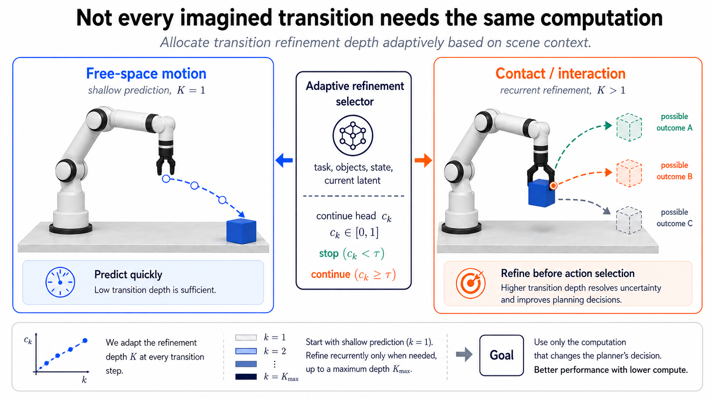

RefineJEPA focuses on this transition-level compute axis:

- standard latent planning spends compute on CEM sampling width, CEM
  iterations, or rollout horizon;
- RefineJEPA spends compute inside each imagined latent transition through
  recurrent refinement depth \(K\);
- dynamic \(K\) chooses the depth per imagined transition rather than applying a
  fixed depth everywhere.

## Method Summary

RefineJEPA starts from LeWM-style latent planning: encode the current visual
observation and goal, roll out candidate action sequences in latent space, and
use CEM to choose the action sequence with the best terminal goal-matching
cost. The outer planner is unchanged. RefineJEPA changes only the transition
predictor.

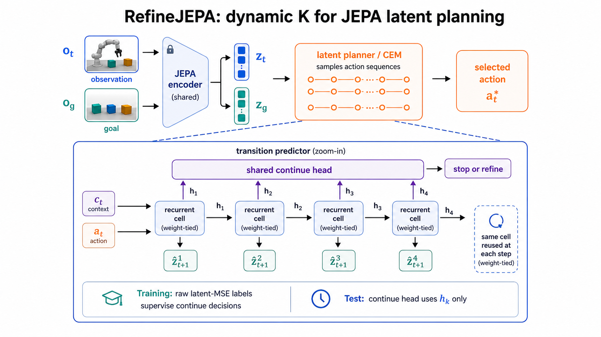

The transition model is a weight-tied recurrent predictor. At each imagined
transition it produces predictions

\[
\hat z_{t+1}^{(1)}, \hat z_{t+1}^{(2)}, \ldots, \hat z_{t+1}^{(K_{\max})}.
\]

A lightweight continue head predicts whether another refinement step is worth
executing. The main learned dynamic-\(K\) experiments train this head with a
relative marginal MSE target:

\[
y_k =
\mathbb{I}
\left[
\frac{e_k - e_{k+1}}{e_k+\epsilon}
>
\tau_{\mathrm{rel}}
\right],
\qquad
\tau_{\mathrm{rel}}=5\times10^{-4}.
\]

Here \(e_k\) is the raw latent MSE at refinement depth \(k\), computed against
the observed next latent during training. At test time, the future latent is not
available: the model stops using only the learned continue head. We sweep the
test-time continue threshold \(\eta\) and report the best success/compute point.

Main configuration for the learned dynamic-\(K\) runs:

| Setting | Value |
| --- | ---: |
| Max refinement depth | \(K_{\max}=4\) |
| Halt label mode | relative marginal MSE improvement |
| \(\tau_{\mathrm{rel}}\) | \(5\times10^{-4}\) |
| Continue-head loss weight | \(0.2\) |
| Minimum depth | \(1\) |

Mean \(K\) always denotes the average selected refinement depth over all CEM
imagined transition predictions, not a fractional per-transition depth. Internally
each transition still uses an integer depth in \(\{1,2,3,4\}\).

## Implementation Details: Continue Head, Actions, and CEM

**What supervision trains the latent continue head?** The learned dynamic-\(K\)
head is trained from relative marginal raw latent-MSE improvement. During
training, the predictor runs all refinement depths and compares each prediction
to the observed next latent. The continue label at depth \(k\) is 1 when one
more refinement step reduces MSE by more than a small relative margin:

\[
y_k =
\mathbb{I}
\left[
\frac{e_k - e_{k+1}}{e_k+\epsilon}
>
5\times 10^{-4}
\right].
\]

At evaluation time, the future target latent is unavailable. The model uses
only the learned continue head to decide whether to stop or refine.

**Is the transition layer an MLP or a transformer?** The transition predictor is
a recurrent, action-conditioned transformer predictor. It has:

- a base action-conditioned transformer with `base_depth=2`;
- a shared recurrent refinement cell with `refine_depth=1`;
- a linear `init_head` for the initial prediction;
- linear `delta_head` and `gamma_head` for residual latent updates;
- a linear `continue_head` for stop/continue prediction.

The refinement cell is weight-tied across depths. Increasing \(K\) reuses the
same cell multiple times; it does not create a deeper untied model.

**What is the continue head structure?** The continue head itself is a linear
classifier:

\[
p_k=\sigma(W h_k+b).
\]

It is not an MLP or transformer. The reason this can still be expressive is
that \(h_k\) is already produced by action-conditioned transformer/refinement
blocks and contains the transition history, candidate action context, and the
current refinement feedback.

**How is it based on action?** Raw actions are first encoded by an action
encoder into action embeddings. Those embeddings condition both the base
transformer and every recurrent refinement cell through conditional transformer
blocks. Therefore the continue head reads \(h_k\), but \(h_k\) is already
conditioned on the candidate action sequence:

\[
p(\mathrm{continue})
=
g(h_k),
\qquad
h_k = F(h_{k-1}, z_{\mathrm{hist}}, a_{\mathrm{hist}}, \hat z^{(k-1)}-z_{\mathrm{anchor}}).
\]

Thus different CEM candidate action sequences can produce different hidden
states and different selected depths.

**How are actions sampled?** At test time, the CEM planner samples many
candidate action sequences from a Gaussian action distribution. Each candidate
sequence is rolled out in latent space with the transition predictor. After the
rollout, the planner scores the candidate by terminal goal-matching cost: the
MSE distance between the predicted terminal latent and the goal latent. CEM
then keeps the low-cost elite candidates and updates the Gaussian distribution
toward them. This repeats for several CEM iterations, and the first action of
the best final sequence is executed.

This action sampling and elite update procedure is evaluation-time planning,
not training-time supervision. Training only sees dataset transitions and the
latent prediction / continue-head losses.

## Main Learned Dynamic-K Results

The table below is the current main result. It uses the relative-improvement
continue target with \(\tau_{\mathrm{rel}}=0.0005\) across all four datasets.
In discussion we refer to this setting as `rel0005`; the remote artifact
directories for this four-dataset sweep are named `rel00005`. Fixed \(K\) rows
and learned dynamic rows are evaluated within the same checkpoint family.

| Dataset | LeWM baseline | Fixed K1 | Fixed K2 | Fixed K3 | Fixed K4 | Best learned dynamic K |
| --- | ---: | ---: | ---: | ---: | ---: | ---: |
| Reacher | 80% | 80% | 82% | 84% | 82% | **86%@K1.08** |
| Cube Single | 72% | **84%** | 82% | 82% | 82% | **84%@K1.00** |
| Cube Double | 66% | 70% | 68% | 68% | 68% | **72%@K1.10** |
| Cube Triple | 74% | 74% | 74% | 72% | 74% | **78%@K1.06** |

Interpretation:

- Reacher, Cube Double, and Cube Triple improve over the best fixed-depth
  baseline while using near-\(K=1\) average compute.
- Cube Single is the useful negative/control case: this checkpoint's best fixed
  depth is already \(K=1\), and the learned selector correspondingly keeps
  almost everything at \(K=1\).
- The main claim is not "deeper is always better." The claim is that transition
  depth is a real compute axis and should be allocated dynamically.

This table supersedes the older `ttjepa_*_dynamic_oracle_k4_10e` learned-head
sweep. That earlier sweep used raw target-MSE depth labels and is kept as a
historical comparison in the experiment ledger.

The continue threshold \(\eta\) is a test-time sweep parameter used to choose
the reported success/compute point; it is intentionally not part of the main
table. The reported operating points use \(\eta=0.45\) for Reacher,
\(\eta=0.70\) for Cube Single, and \(\eta=0.50\) for Cube Double and Cube
Triple.

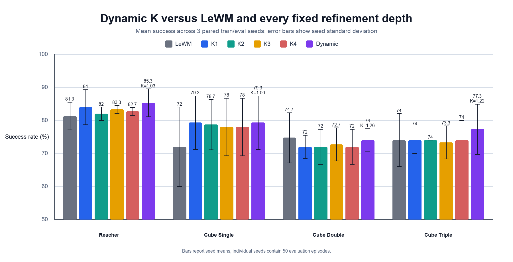

## Fixed-Depth and Outcome Analysis

Fixed-depth evaluation motivates the dynamic-compute question directly: useful
depth is task- and checkpoint-dependent, so a uniform fixed \(K\) is the wrong
interface.

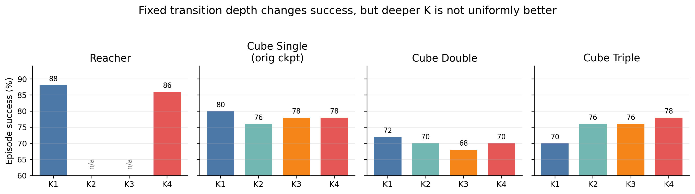

The paired `K1`/`K4` outcome split shows why uniform deep refinement is a poor
default. Most episodes are either already solved by `K1` or remain unsolved at
`K4`; only a small subset is genuinely helped by deeper refinement. Dynamic
compute should identify that subset while avoiding redundant or harmful extra
refinement. In the current `rel00005` paired split, fixed `K4` helps `3/50`
Reacher episodes and `1/50` Cube Triple episodes, while helping no Cube Single
or Cube Double episodes.

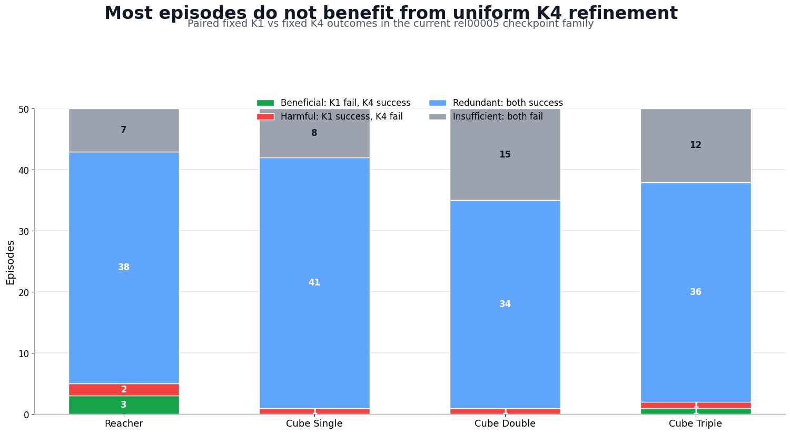

## Depth Allocation Statistics

The best learned dynamic policies spend extra compute on only a small subset of
imagined transitions.

| Dataset | Best dynamic | K=1 | K=2 | K=3 | K=4 | Refined beyond K1 |
| --- | ---: | ---: | ---: | ---: | ---: | ---: |
| Reacher | 86%@K1.08 | 92.19% | 7.65% | 0.16% | 0.007% | 7.81% |
| Cube Single | 84%@K1.00 | 99.987% | 0.013% | 0% | 0% | 0.013% |
| Cube Double | 72%@K1.10 | 91.20% | 7.95% | 0.78% | 0.070% | 8.80% |
| Cube Triple | 78%@K1.06 | 95.20% | 3.24% | 1.50% | 0.049% | 4.80% |

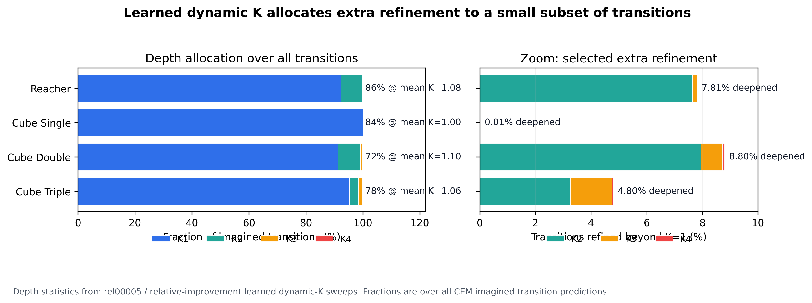

We also trace where extra refinement is spent inside each CEM rollout. The
location is not uniform. For example, Cube Triple refines most often in the
first imagined transition and progressively less later in the rollout.

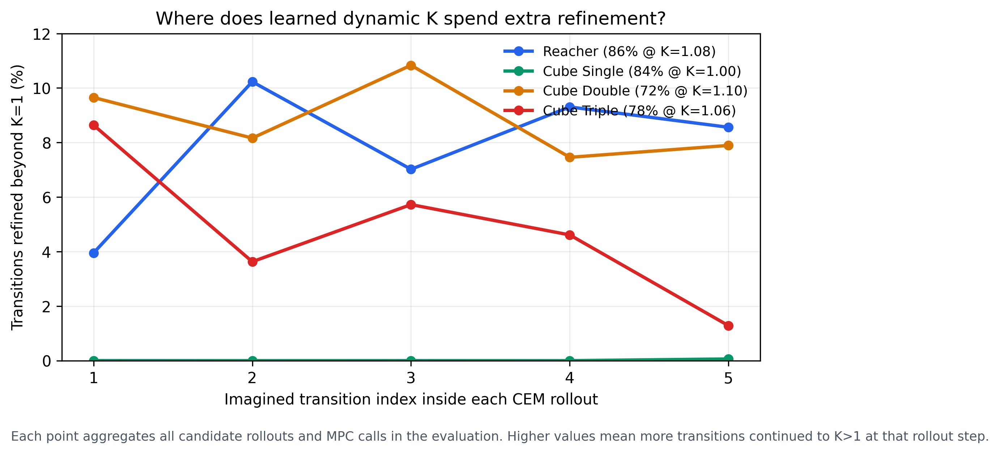

The selected extra depth is mostly \(K=2\), with rare \(K=3/K=4\) use.

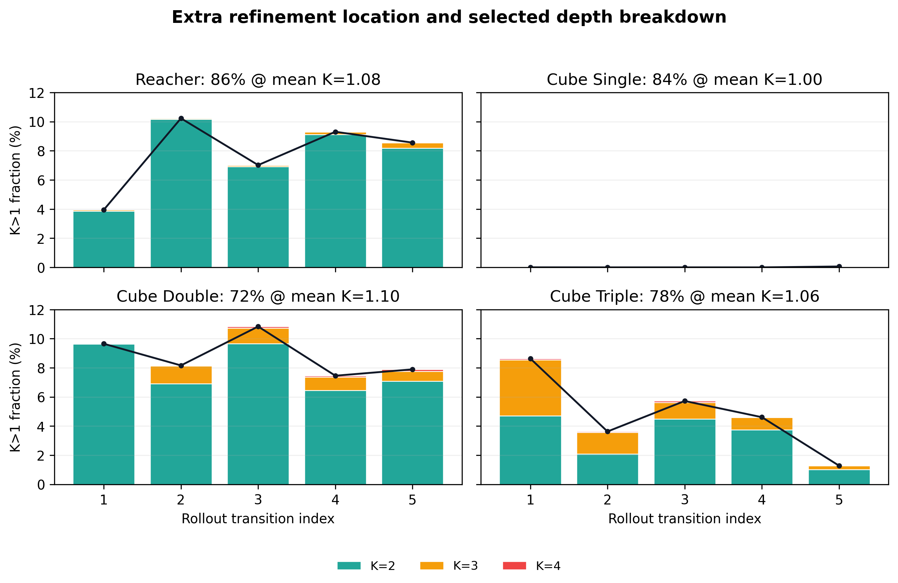

## Current Raw Target-Latent MSE Diagnostic

We recomputed the raw target-latent MSE diagnostic on the current `rel00005`
checkpoint family, so the fixed-depth columns below match the main table. After
fixed-depth evaluation, this diagnostic compares true target-latent errors at
`K1` and `K4`; it selects `K4` only when `K4` has lower target-latent MSE than
`K1` by a chosen tolerance. This is still **not deployable**, because the true
future target latent is unavailable at test time. Its purpose is to measure how
much refinement-allocation signal is present in raw latent error.

| Dataset | Fixed K1 | Fixed K4 | MSE diagnostic | Hindsight K1/K4 chooser | K1 fail / K4 success |
| --- | ---: | ---: | ---: | ---: | ---: |
| Reacher | 80%@K1.00 | 82%@K4.00 | 80%@K1.00 to K2.20 | 86%@K1.18 | 3 / 50 |
| Cube Single | 84%@K1.00 | 82%@K4.00 | 84%@K1.00 to K1.12 | 84%@K1.00 | 0 / 50 |
| Cube Double | 70%@K1.00 | 68%@K4.00 | 70%@K1.00 to K2.14 | 70%@K1.00 | 0 / 50 |
| Cube Triple | 74%@K1.00 | 74%@K4.00 | 74%@K1.00 to K1.84 | 76%@K1.06 | 1 / 50 |

Takeaways:

- On the current checkpoint family, raw target-MSE by itself does not recover
  the helped cases. The best MSE diagnostic operating points tie shallow `K1`
  rather than improving on it.
- The hindsight `K1/K4` chooser still shows sparse useful depth: Reacher has
  `3/50` episodes where `K4` fixes a `K1` failure, and Cube Triple has `1/50`.
- This makes the key limitation sharper: raw latent error is related to
  prediction quality, but it is not the same as planning utility. The learned
  dynamic policy can outperform this post-hoc target-MSE diagnostic because it
  selects depth per imagined transition inside the planner, rather than making a
  single episode-level `K1/K4` choice from target error.

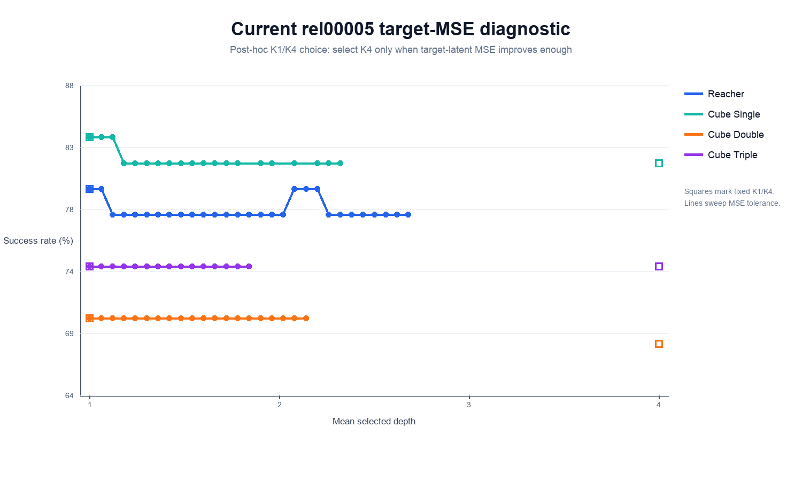

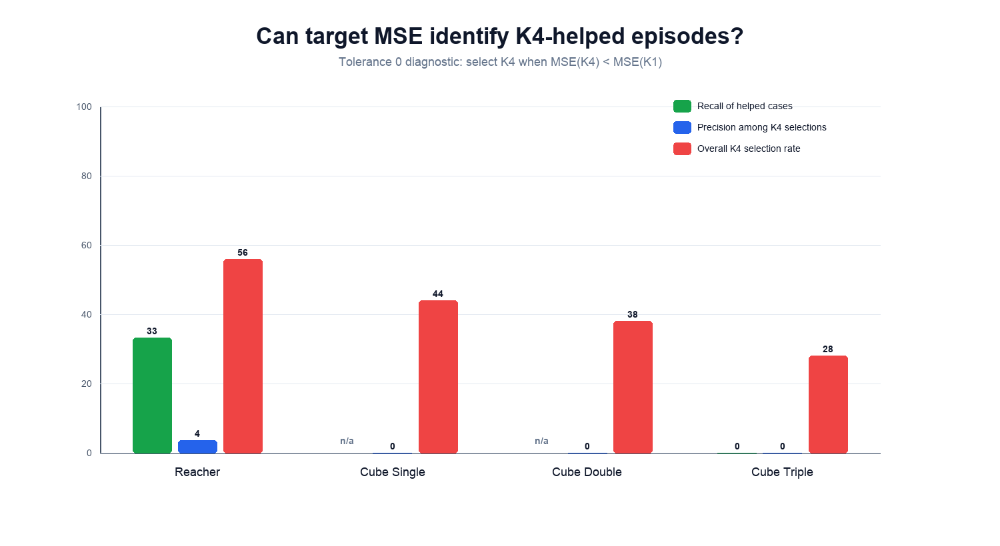

### Current Target-MSE Allocation Confusion on Cube Triple

The cube-triple outcome split makes the MSE failure mode concrete. With the
tolerance-0 post-hoc selector, target MSE sends an episode to `K4` whenever the
`K4` prediction has lower target-latent MSE than `K1`.

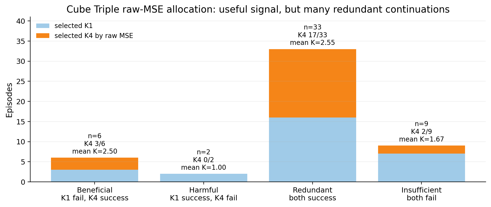

Readout:

- Target MSE misses the only beneficial `K1`-fail / `K4`-success case in this
  current Cube Triple checkpoint.
- It still sends `12/36` redundant both-success cases and `2/12` both-fail
  cases to `K4`, spending extra compute where the episode outcome does not
  improve.
- It avoids the single harmful `K1`-success / `K4`-fail case.

This is the main diagnostic conclusion: target-latent MSE is a useful analysis
tool, but it is not the planner's objective. The planner cares about candidate
ranking and selected actions, so a lower target-latent MSE can be irrelevant to
success, while a small latent change near a decision boundary can matter.

## Mechanistic Analysis

We tested whether deeper recurrent refinement simply causes global latent
smoothing or collapse. The first pass does not support that explanation.

Artifacts: `analysis/k_smoothing_20260622`.


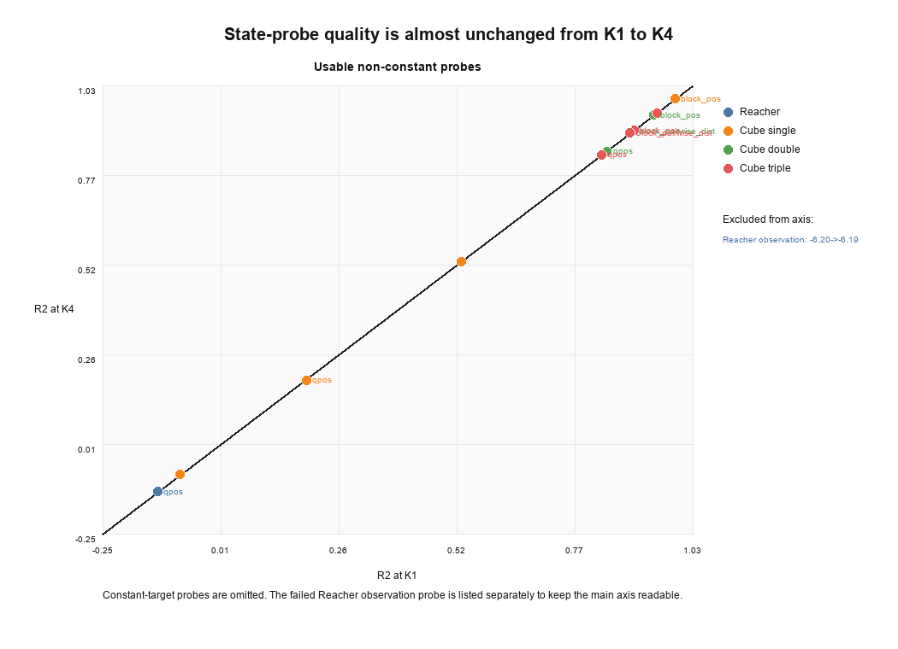


Observed result:

- Global latent spectrum barely changes from K1 to K4.
- Linear state probes are also nearly unchanged.
- Depth-helped and depth-hurt subsets do not show a clean global-collapse
  signature.

This suggests the remaining failure mode is more local: extra refinement matters
when it changes CEM candidate ranking or selected actions, not necessarily when
it changes broad latent-spectrum statistics.

## Future Work: Planner-Aware Continue Supervision

The current continue head learns from latent prediction improvement. A natural
next step is to train the same lightweight head with a more planner-aware
teacher signal.

The earlier CEM-aware diagnostic did this offline: for the same CEM candidate
set, it evaluated costs at \(K=1,2,3,4\), constructed features from top-k cost
statistics and elite-ranking changes, and trained a separate MLP selector to
predict whether deeper \(K\) improves planner cost. This was useful evidence
that CEM ranking contains allocation signal, but it was not integrated into the
transition predictor and did not provide a cheap deployable stopping rule.

The cleaner future variant is:

1. During training, sample a small set of candidate action sequences.
2. Roll them out at multiple depths.
3. Use top-k CEM cost improvement or elite-ranking change to create a
   planner-aware continue label.
4. Train the existing `continue_head(h_k)` with this label while keeping the
   planner-derived label stop-gradient.
5. At evaluation time, still use only the cheap latent continue head.

This would distill an expensive CEM-aware teacher into the transition-level
head. The goal is to replace "does one more step reduce latent MSE?" with the
more planner-aligned question: "does one more step improve the candidate
ranking or action selection that CEM actually uses?"

## Appendix: Additional Experiment Ledger

This appendix records completed runs that are useful for follow-up analysis but
should not be merged into the main four-dataset learned dynamic-\(K\)
comparison above. The runs below either use planner-aware selection signals or
different training losses, so they answer related but distinct questions.

### Planner-Aware Selectors on Cube Triple

These runs were evaluated on the cube-triple recurrent checkpoint where fixed
`K1` is `70%` and fixed `K4` is `78%`. They test selection rules closer to
planner behavior than raw next-latent MSE.

| Selector family | Best / representative result | Interpretation |
| --- | ---: | --- |
| Learned planner selector | `80%@K2.53-2.63` (`t=0.38-0.41`) | Can exceed fixed K4, but uses substantially more depth than raw-MSE learned head |
| Benefit-cost rule | `78%@K2.85` (`beta=0`) | Recovers fixed K4 success with lower mean depth than uniform K4 |
| Cost-change rule | `78%@K3.38` (`alpha=0.25`) | Also recovers fixed K4 but is compute-heavy |
| Rank-stability rule | `74%@K2.04-2.48` | Does not recover fixed K4 in this run |

These are evidence that planner-aligned selection is promising. They are not
part of the current main table because the first paper version focuses on the
simpler latent-MSE signal and its failure modes.

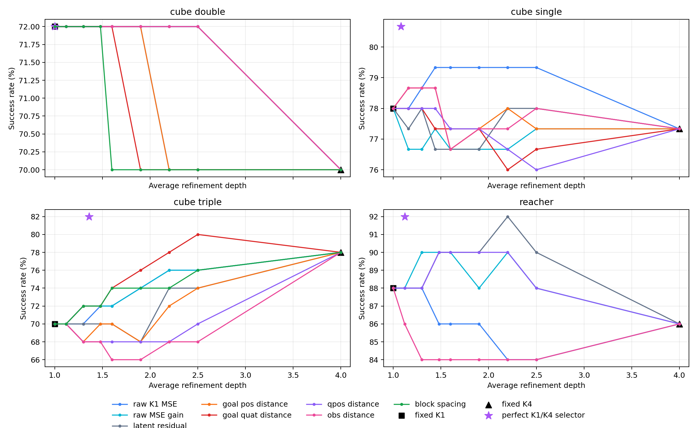

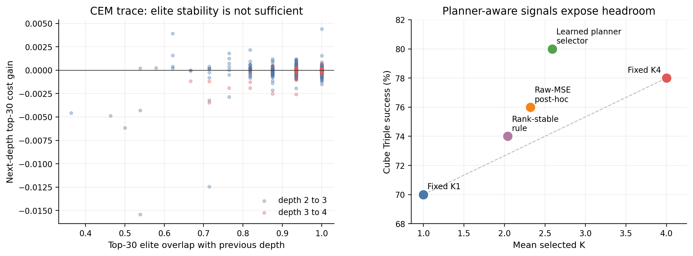

The planner trace supports the same conclusion from another angle. The trace
records top-30 CEM elite-set overlap between adjacent refinement depths and the
relative improvement in top-30 candidate cost from evaluating the next depth.
Many rollout calls already have very high elite overlap, yet their next-depth
cost benefit can still be positive, negative, or nearly zero. A simple
rank-stability rule therefore reaches only `74%@K2.04`, while a learned
planner-feature selector reaches `80%@K2.59`.

This is useful evidence for the paper's analysis section, but it is not yet the
complete CEM-ranking figure. The stronger paper figure should add:

- Kendall tau between the full `K1` and `K4` candidate-cost rankings.
- Top-elite overlap by outcome category: beneficial, harmful, redundant, and
  insufficient.
- Whether the best selected candidate/action changes between `K1` and `K4`.
- Whether beneficial cases correspond to ranking corrections and harmful cases
  correspond to unfavorable ranking shifts.

The target conclusion is sharper than "deeper K lowers MSE": the planner cares
about candidate ordering and action selection. Raw latent MSE captures some
prediction-improvement pressure, but planning utility depends on whether the
refined latent rollout changes the CEM decision in the right direction.

### Latent Smoothing / Representation Checks

These diagnostics were generated to test a possible failure explanation: deeper
refinement might improve global latent MSE while smoothing away task-relevant
details. The current broad readout is conservative. The global latent spectrum
and linear state-probe quality are almost unchanged between `K1` and `K4`, so
the existing evidence does not support a broad representation-collapse story.
The remaining failure mode is more likely local and planner-facing: refinement
can change candidate ordering or action choice in ways that raw latent MSE does
not fully capture.

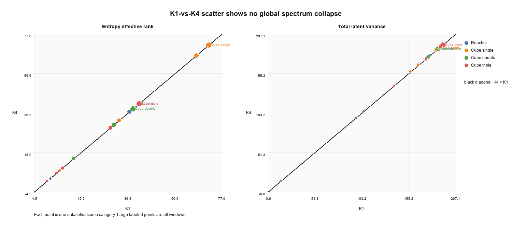

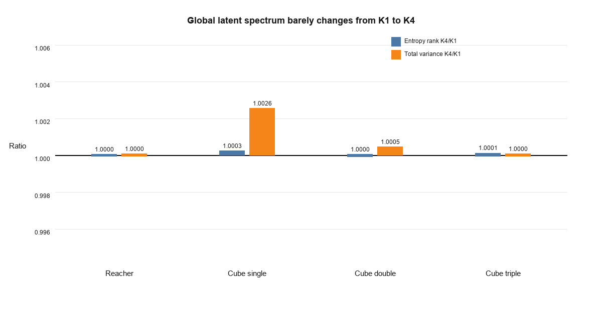


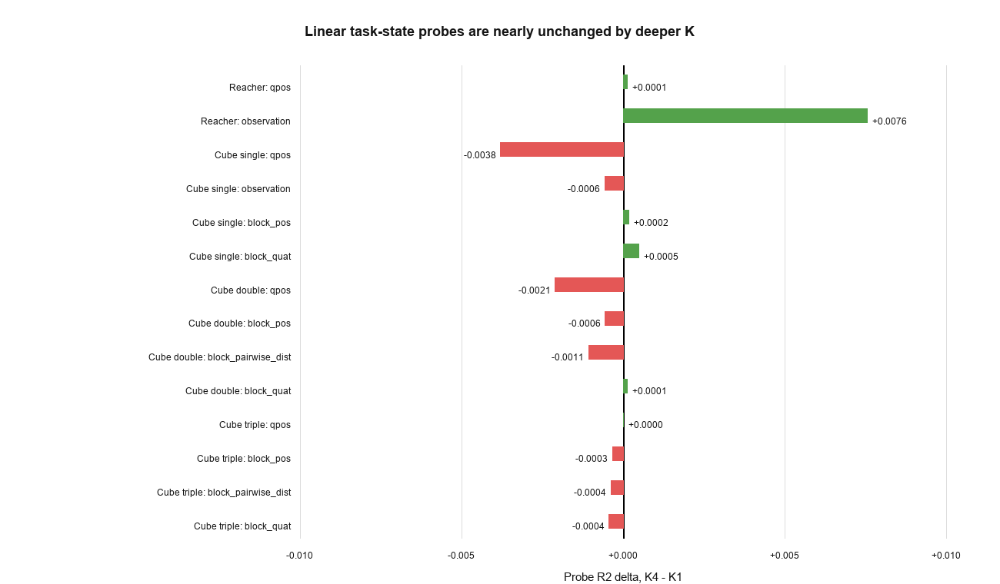

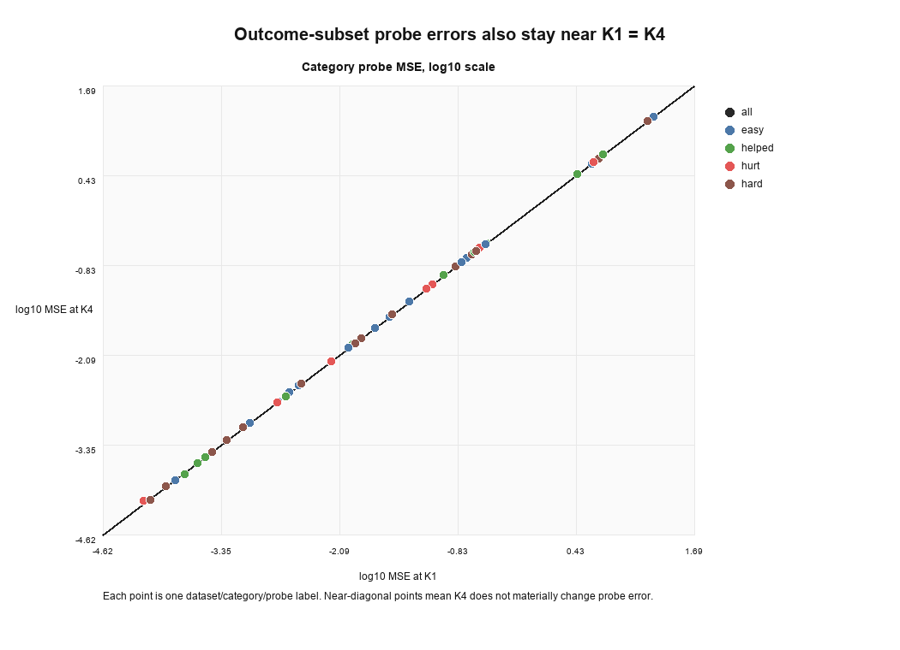

### Cube Triple Joint-Depth Variants

These variants change the training objective, so they are better treated as
evidence for a separate training-time regularization story rather than the main
dynamic test-time compute result.

| Run | Fixed K1 | Fixed K4 | Best learned dynamic result | Readout |
| --- | ---: | ---: | ---: | --- |
| `rel00005` | 74% | 74% | `78%@K1.064` | Clean dynamic-compute gain inside this variant |
| `rel0002` | 78% | 72% | `78%@K1.002-1.035` | Dynamic selection avoids harmful over-refinement |
| `rel0005` | 80% | 80% | `80%@K1.000-1.062` | Stronger training effect; likely not a pure selector result |
| `rel0001` | n/a | n/a | `74%@K1.47` | Weaker |
| `rel000` | n/a | n/a | `66%` near K1 | No-margin target fails |

The important note is that `rel0005` reaching `80%` at both fixed depths should
be described as a training-time regularization effect, not as the headline
dynamic-\(K\) result.

### Cube Double Depth-Loss Variants

These runs were started because cube double was the weakest main-table case for
dynamic \(K\). They show that changing the training objective can move the
fixed-depth behavior, but they do not give a cleaner learned dynamic-compute
result than the main checkpoint.

| Run | Fixed-depth behavior | Best learned dynamic result | Readout |
| --- | --- | ---: | --- |
| `finalonly_rel00005` | K1 46%, K2 60%, K3 62%, K4 70% | `76%@K3.53` | Improves success but spends near-deep compute; not a clean efficiency result |
| `joint_marginal_rel00005` | K1 70%, K4 68% | `72%@K1.10-1.60` | Slight dynamic gain, still near the original cube-double ceiling |
| `lightinter01_rel00005` | K1 76%, K4 68% | `72%@K1.15-1.57` | Shallow fixed K1 is strongest; dynamic selector does not improve it |

For Paper 1, cube double should remain a saturation case in the older
checkpoint family: the original raw-MSE learned selector correctly avoids
spending much extra compute, but it does not discover a hidden deep-refinement
gain.

### Machine and Git Sync Notes

The GitHub `main` branch contains this RefineJEPA README. The experiment
machines may still show the original LeWM README when checked out on the
development branch:

```text
codex/recurrent-lewm
```

On the new 8xA800 machine, `/vepfs/zijian/TTJepa` also contains local,
uncommitted development artifacts:

```text
M jepa.py
?? analysis/
?? scripts/k_refinement_analysis.py
?? scripts/k_smoothing_analysis.py
?? scripts/train_planner_selector.py
```

Those files contain planner-selector and analysis work that has not been
merged into `main`. Treat GitHub `main` as the current public documentation
state, and treat `/vepfs/zijian/TTJepa` as the active experiment workspace.

## Experiment Ledger

Full experiment records, including paths, logs, exploratory alternatives, and
older checkpoint families, are kept in:

- [TTJEPA_EXPERIMENT_RESULTS.md](TTJEPA_EXPERIMENT_RESULTS.md)
- [TTJEPA_DYNAMIC_K_RESEARCH.md](TTJEPA_DYNAMIC_K_RESEARCH.md)
- [paper.md](paper.md)

Important local artifacts:

- `analysis/readme_figures/`
- `analysis/k_refinement_rel00005_current/`
- `analysis/k_refinement_all_20260620_024634/`
- `analysis/k_smoothing_20260622/`
- `analysis/paper1_figures/`
- `figures/depth_allocation_rel00005.png`
- `figures/depth_by_rollout_step_rel00005.png`
- `figures/depth_by_rollout_step_stacked_rel00005.png`

Important remote result directories:

- `/vepfs/zijian/lewm_data/ttjepa_reacher_joint_marginal_rel00005_k4_10e`
- `/vepfs/zijian/lewm_data/ttjepa_cube_joint_marginal_rel00005_k4_10e`
- `/vepfs/zijian/lewm_data/ttjepa_cube_double_joint_marginal_rel00005_k4_10e`
- `/vepfs/zijian/lewm_data/ttjepa_cube_triple_joint_marginal_rel00005_k4_10e`

Naming note: the main result above is the \(\tau_{\mathrm{rel}}=0.0005\)
four-dataset sweep. Some older notes abbreviate this setting as `rel0005`.
The remote directory spelling is `rel00005`. A separate cube-triple-only
directory named `rel0005` also exists and is treated as an auxiliary
training-variant record in the experiment ledger, not the four-dataset main
table.

## Repository Layout

Current high-level organization:

```text
.
├── README.md                         # RefineJEPA project entrypoint
├── README.zh-CN.md                   # Chinese project notes
├── TTJEPA_EXPERIMENT_RESULTS.md      # Full experiment ledger
├── TTJEPA_DYNAMIC_K_RESEARCH.md      # Working research notes
├── paper.md                          # Paper outline / claim boundary notes
├── jepa.py                           # JEPA model and rollout/eval hooks
├── module.py                         # recurrent predictor and continue head
├── recurrent_halting.py              # continue-label construction
├── train.py                          # training losses and logging
├── eval.py                           # CEM/MPC evaluation entrypoint
├── config/                           # train/eval Hydra configs
├── analysis/                         # local analysis figures copied for README/paper
└── figures/                          # main paper/README figures
```

## Cleanup Roadmap

The next repo cleanup pass should be:

1. Keep README focused on the current RefineJEPA paper story.
2. Keep long experiment tables, failed variants, and path-heavy records in
   [TTJEPA_EXPERIMENT_RESULTS.md](TTJEPA_EXPERIMENT_RESULTS.md).
3. Keep LeWM reproduction instructions in
   [LEWM_REPRODUCTION_NOTES.md](LEWM_REPRODUCTION_NOTES.md).
4. Move any stale temporary scripts or caches out of the tracked source tree.

## Citation / Provenance

This work builds on JEPA-style latent world models and LeWM-style latent
planning. RefineJEPA modifies the LeWM transition predictor and test-time
planning path to study dynamic recurrent refinement depth \(K\).
