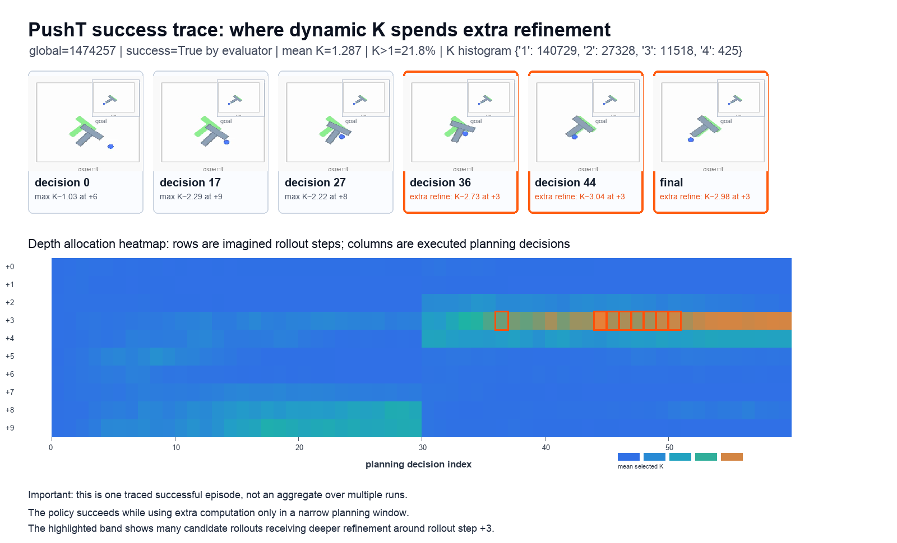
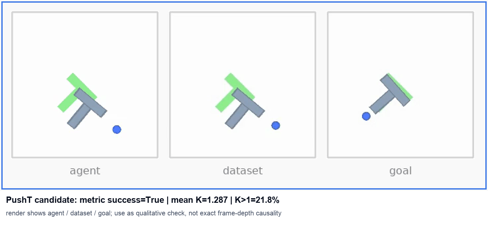

# RefineJEPA：用于 JEPA 潜在规划的动态 K

英文版见 [README.md](README.md)。

RefineJEPA 研究潜在世界模型规划中的**动态测试时计算**。模型用一个
weight-tied recurrent transition predictor 对同一个 imagined transition
逐步 refinement，再由联合训练的 continue head 决定何时停止。外层的
LeWM 风格 MPC/CEM planner 保持不变。

核心问题是：

> 在 latent MPC/CEM planning 中，哪些 imagined transitions 值得分配更深
> 的 recurrent refinement？

## Motivation

机器人在 free space 中移动手臂通常比较容易预测；接触、抓取、滑动和
多物体交互则更关键，一点 dynamics error 就可能改变 CEM 选择的动作。
所以，不应该对所有 imagined transitions 使用相同的 transition-model
depth。

RefineJEPA 把 recurrent refinement depth \(K\) 作为 transition-level
compute axis。每个 transition 实际使用整数深度 \(K\in\{1,2,3,4\}\)，
但不同 CEM candidates 和 rollout steps 可以选择不同深度。

## 方法

RefineJEPA 从 LeWM 风格 latent planning 出发：编码当前 observation 和
goal，在 latent space 中 rollout 候选 action sequences，根据 terminal
latent 与 goal latent 的距离打分，再由 CEM 更新 action distribution 并
选择最终动作。

Transition predictor 由两层 action-conditioned transformer 和一个共享的
recurrent refinement block 组成。重复使用同一个 block 得到：

\[
\hat z_{t+1}^{(1)},\hat z_{t+1}^{(2)},\ldots,
\hat z_{t+1}^{(K_{\max})}, \qquad K_{\max}=4.
\]

因为 refinement block weight-tied，增加 \(K\) 只增加 inference depth，
不会增加参数量。Action embedding 会同时进入 base transformer 和每次
refinement。共享的线性 continue head 读取 action-conditioned recurrent
state：

\[
p_k=\sigma(Wh_k+b).
\]

测试时，如果 \(p_k\leq\eta\) 就停止，否则继续复用同一个 recurrent
cell，最多运行到 \(K_{\max}\)。测试时不会看到 future observation 或
target latent。

### Recurrent predictor 和 continue head 到底用什么监督？

当前四任务主模型是联合训练的，不是训练完 predictor 后再外挂 selector。
总目标为：

\[
\mathcal L=
\mathcal L_{\mathrm{final}}
+0.5\,\mathcal L_{\mathrm{inter}}
+0.2\,\mathcal L_{\mathrm{cont}}
+0.09\,\mathcal L_{\mathrm{SIGReg}}.
\]

四项监督分别是：

- **最深层预测损失**：
  \(\mathcal L_{\mathrm{final}}=\|\hat z_{t+1}^{(4)}-z^*_{t+1}\|_2^2\)。
  target 不 detach，保留 LeWM 的 encoder/predictor 端到端训练。
- **中间深度预测损失**：对 \(K=1,2,3\) 的预测计算 latent MSE，但 target
  使用 \(\operatorname{sg}(z^*_{t+1})\)。它让浅层 exit 也能预测得好，同时
  避免每个中间层 loss 都直接推动 target encoder。
- **Continue head 监督**：先在 stop-gradient 下计算每个深度的 raw
  target-latent MSE：

  \[
  e_k=\|\hat z_{t+1}^{(k)}-z^*_{t+1}\|_2^2.
  \]

  然后根据“再运行一步带来的相对 MSE 降幅”构造二分类 label：

  \[
  y_k=\mathbb I\left[
  \frac{e_k-e_{k+1}}{e_k+\epsilon}>5\times10^{-4}
  \right].
  \]

  \(y_k=1\) 表示下一次 refinement 带来了足够大的 relative marginal
  MSE improvement。Continue head 使用
  \(\operatorname{BCEWithLogits}(Wh_k+b,y_k)\) 训练；主实验不使用
  `pos_weight`。这个 BCE 会经过 \(h_k\) 反传，所以 selector 与 recurrent
  predictor 是一起学的。
- **SIGReg**：保留原始 LeWM 的 representation regularization。

因此，当前方法不是测试时直接查看 MSE，而是让 continue head 在训练时
学习一个 MSE-derived supervision 的 deployable proxy。

### K=1、K=2、K=3 时，recurrent 的输入输出分别是什么？

这里有两层不同的循环。外层 autoregressive rollout 预测不同世界时间的
\(z_{t+1},z_{t+2},\ldots\)；dynamic \(K\) 控制的是内层循环，即对**同一个
next-state prediction**反复 refinement。

以 `history_size=3` 为例，一个 imagined transition 的输入为：

\[
x=[z_{t-2},z_{t-1},z_t], \qquad
c=[a_{t-2},a_{t-1},a_t].
\]

其中 \(c\) 是某一条 CEM candidate action sequence 的 action embeddings。
Base transformer 先产生 \(h_0\)、初始 latent guess \(\hat z^{(0)}\)，以及
由 \(x\) 得到且在整个内层循环中保持不变的 anchor。代码报告的 \(K=1\)
已经包含一次 shared refinement cell：

\[
f_1=\hat z^{(0)}-\operatorname{anchor}(x), \qquad
h_1=R_\theta(h_0,c,f_1),
\]

\[
\hat z^{(1)}=\hat z^{(0)}
+s\,\sigma(\Gamma(h_1))\odot\Delta(h_1).
\]

如果 continue head 要求继续，第二次仍然使用同一组参数、同一份 latent
history 和同一 candidate action。变化的是上一轮 hidden state 和预测反馈：

\[
f_2=\hat z^{(1)}-\operatorname{anchor}(x), \qquad
h_2=R_\theta(h_1,c,f_2),
\]

\[
\hat z^{(2)}=\hat z^{(1)}
+s\,\sigma(\Gamma(h_2))\odot\Delta(h_2).
\]

第三、第四次分别用 \((h_2,\hat z^{(2)})\) 和
\((h_3,\hat z^{(3)})\) 重复同样的更新。这个 inner loop 不会编码新图像，
也不会重新 sample action。上一轮 prediction 通过相对 anchor 的 residual
反馈回来，而不是替换原始 history。

当 selector 在 \(K_i\) 停止时，\(\hat z_{t+1}^{(K_i)}\) 会被追加到 imagined
temporal history。外层 rollout 将 history 移动为
\([z_{t-1},z_t,\hat z_{t+1}^{(K_i)}]\)，加入 candidate 的下一个 action，
然后重新调用 base transformer 预测 \(z_{t+2}\)。因此，hidden state 只在
同一个 transition 的 refinement 内 recurrent；跨 transition 的 temporal
memory 由 latent/action history 携带。

## 主结果

下面结果来自三组 paired train/eval seeds：`3072/42`、`3073/43`、
`3074/44`，每组评估 50 个 episodes。表中 success 为三组 seed 的
mean \(\pm\) sample standard deviation。LeWM 是原始 non-recurrent
baseline；Fixed \(K=1,2,3,4\) 和 dynamic \(K\) 来自同一组 RefineJEPA
checkpoints。

| Dataset | LeWM | Fixed K1 | Fixed K2 | Fixed K3 | Fixed K4 | Learned dynamic K |
| --- | ---: | ---: | ---: | ---: | ---: | ---: |
| Reacher | 81.3\(\pm\)4.2 | 84.0\(\pm\)5.3 | 82.0\(\pm\)2.0 | 83.3\(\pm\)1.2 | 82.7\(\pm\)1.2 | **85.3\(\pm\)4.2 @ K1.03** |
| Cube Single | 72.0\(\pm\)12.0 | **79.3\(\pm\)8.1** | 78.7\(\pm\)7.6 | 78.0\(\pm\)8.7 | 78.0\(\pm\)8.7 | **79.3\(\pm\)8.1 @ K1.00** |
| Cube Double | **74.7\(\pm\)7.6** | 72.0\(\pm\)3.5 | 72.0\(\pm\)5.3 | 72.7\(\pm\)5.0 | 72.0\(\pm\)5.3 | 74.0\(\pm\)3.5 @ K1.26 |
| Cube Triple | 74.0\(\pm\)8.0 | 74.0\(\pm\)4.0 | 74.0\(\pm\)0.0 | 73.3\(\pm\)5.0 | 74.0\(\pm\)6.0 | **77.3\(\pm\)7.6 @ K1.22** |
| PushT H=10 / goal offset=50 | 11.3\(\pm\)5.0 | 13.3\(\pm\)6.1 | 14.7\(\pm\)6.4 | 15.3\(\pm\)8.1 | 12.7\(\pm\)8.3 | **17.3\(\pm\)7.6 @ K1.02** |

当前结论需要按任务分别理解：

- Reacher 相比 LeWM 提升 4.0 points，相比最好的 fixed depth 提升 1.3。
- Cube Triple 相比 LeWM 和所有 fixed depths 都提升 3.3 points。
- Cube Single 是有价值的 negative/control case：Fixed \(K=1\) 已经最强，
  selector 基本全部停在 \(K=1\)。
- Cube Double 超过所有 fixed-depth RefineJEPA 结果，但仍比 LeWM 低 0.7。
- 在明确标注的 long-horizon PushT setting 中，dynamic \(K\) 相比 LeWM
  提升 6.0 points，相比最好的 fixed depth 提升 2.0 points，而 mean
  \(K=1.02\)。这一行同时改变了 planner horizon 与 goal offset，不能被
  解读成相对 default PushT 的单调 horizon 对比。

Seed 间方差仍然较大，所以目前支持的是方法趋势，而不是“每个任务上都
统计显著胜出”的结论。

### Threshold 选择口径

主表中的 dynamic 结果来自 test-time \(\eta\) sweep 后观察到的最佳
success/mean-\(K\) operating point：Reacher \(0.45\)、Cube Single
\(0.70\)、Cube Double \(0.45\)、Cube Triple \(0.30\)、PushT H=10/goal offset=50
\(0.60\)。这些 threshold
是在 evaluation sweep 上选出的，因此当前表格应被理解为 **post-hoc
Pareto envelope**，不是无偏 test estimate。最终论文应在 held-out
validation episodes 上选择 \(\eta\)，然后在 test set 上只评一次。

## Compute 分配到了哪里？

| Dataset | Success / mean K | K=1 | K=2 | K=3 | K=4 | K>1 |
| --- | ---: | ---: | ---: | ---: | ---: | ---: |
| Reacher | 85.3% / 1.03 | 96.77% | 3.11% | 0.12% | 0.003% | 3.23% |
| Cube Single | 79.3% / 1.00 | 99.984% | 0.017% | 0.0001% | 0% | 0.017% |
| Cube Double | 74.0% / 1.26 | 76.49% | 21.09% | 1.69% | 0.72% | 23.51% |
| Cube Triple | 77.3% / 1.22 | 89.41% | 3.71% | 2.64% | 4.25% | 10.59% |

Mean \(K\) 表示每个 imagined transition 平均执行多少次 recurrent cell，
是 model-compute proxy，不等同于真实 latency。Batched CEM 下，少数深层
transition 可能拖慢整个 batch；最终论文仍需要 success-latency 与
throughput measurement。

额外 refinement 在 rollout 中也不是均匀分布。Cube Triple 最常在第一
个 imagined transition 上使用额外深度，后续逐步减少。

### PushT 定性成功 trace

下面是一个单独的 PushT H=10/goal offset=50 成功 episode，只作为 qualitative
trace，不代表 aggregate benchmark。`global=1474257`、\(\eta=0.30\)
时 mean \(K=1.287\)，21.8% 的 imagined predictions 使用 \(K>1\)，最强
refinement band 位于 imagined rollout step \(+3\) 附近。为了让 extra
refinement 的位置更清楚，这个 visualization 使用了比主表 aggregate
operating point 更低的 threshold；主表 PushT 数字对应 \(\eta=0.60\)，
两者不能混作同一个定量结果。

MP4: [pusht_success_highk_env6_annotated.mp4](figures/pusht_success_highk_env6_annotated.mp4)

## 为什么不能测试时直接用 target MSE？

一个 50-episode post-hoc diagnostic 比较 fixed \(K=1\) 和 \(K=4\) 的真实
target-latent MSE。它在部署时不可用，因为 planner 看不到 future target
latent；它也不是 learned head 的直接 baseline，因为 diagnostic 每个
episode 只做一次 K1/K4 选择，而 RefineJEPA 对每个 imagined transition
做逐层 K-to-K+1 决策。

| Dataset | Fixed K1 | Fixed K4 | Target-MSE diagnostic | Hindsight K1/K4 ceiling |
| --- | ---: | ---: | ---: | ---: |
| Reacher | 80%@K1.00 | 82%@K4.00 | 80%@K1.00--K2.20 | 86%@K1.18 |
| Cube Single | 84%@K1.00 | 82%@K4.00 | 84%@K1.00--K1.12 | 84%@K1.00 |
| Cube Double | 70%@K1.00 | 68%@K4.00 | 70%@K1.00--K2.14 | 70%@K1.00 |
| Cube Triple | 74%@K1.00 | 74%@K4.00 | 74%@K1.00--K1.84 | 76%@K1.06 |

这个结果说明 raw target-latent error 含有 refinement signal，但不等于
planner objective。CEM 真正依赖 candidate ranking 和 selected action。
MSE 下降可能完全不改变动作，而 decision boundary 附近很小的 latent
变化反而可能改变最终 plan。

## 机制检查

当前分析不支持“更深 recurrence 导致全局 latent collapse”这一解释：

- \(K=1\) 到 \(K=4\) 的 global latent spectrum 几乎不变；
- linear state-probe quality 基本不变；
- depth-helped 与 depth-hurt subsets 没有明显的 global-collapse signature。

更可能的机制是局部且 planner-facing 的：refinement 是否改变 candidate
ordering 或 action selection。Kendall tau、elite overlap、selected-action
change 和真实 wall-clock measurement 是目前优先级最高的补充实验。

## 完整实验记录

README 只保留当前 paper-facing result。更长的表格、训练变体、失败实验、
planner-aware diagnostics 和路径记录在：

- [TTJEPA_EXPERIMENT_RESULTS.md](TTJEPA_EXPERIMENT_RESULTS.md)
- [TTJEPA_DYNAMIC_K_RESEARCH.md](TTJEPA_DYNAMIC_K_RESEARCH.md)
- [paper.md](paper.md)
- [LEWM_REPRODUCTION_NOTES.md](LEWM_REPRODUCTION_NOTES.md)

当前 recurrent implementation 位于 `codex/recurrent-lewm` 开发分支。正式
artifact release 前还需要合并到 `main`，并补齐 pinned `uv` environment、
tests、checkpoint/data instructions 以及精确 train/eval commands。因此，
当前仓库应视为 active research release，而不是 frozen reproducibility
artifact。

## Citation 与 License

RefineJEPA 建立在 JEPA representation learning 和 LeWM latent world-model
planning 之上，并修改 LeWM transition predictor 与 inference path 来研究
动态 recurrent refinement depth \(K\)。论文发布时会补充 RefineJEPA 的
BibTeX。

License 见 [LICENSE](LICENSE)。
